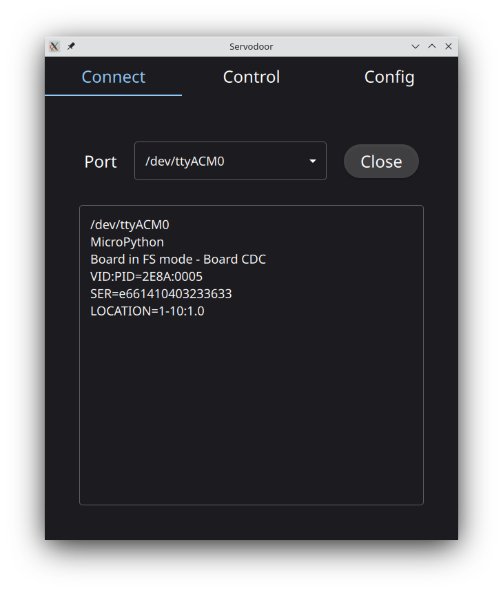
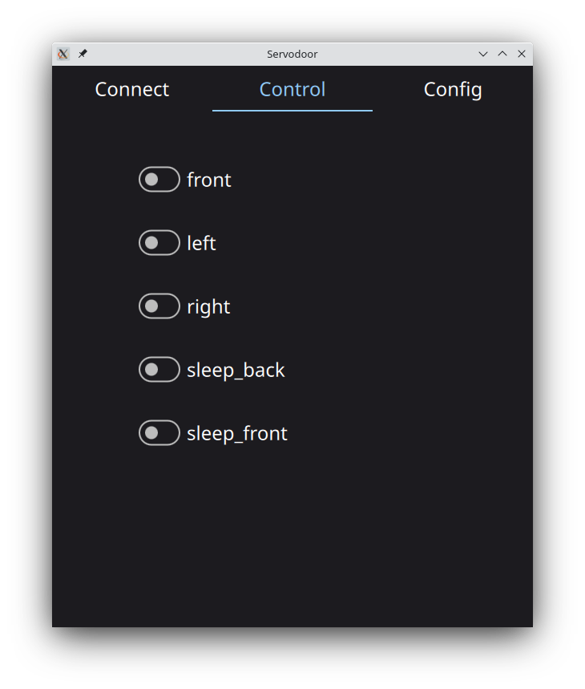
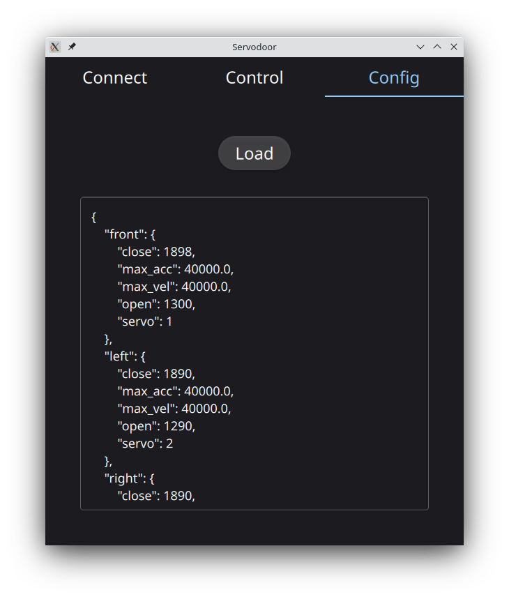
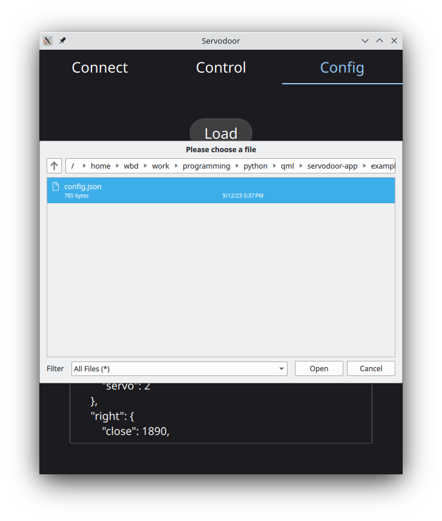

# Servodoor-app: RC servo based door control application  

A simple GUI for controlling up to 18 (RC servo) doors. Designed for use
with an automated T-Maze system. 

## Installing
Install using pip 

```bash
$ pip install servodoor-app 
```

## Installing from source

This package uses the [poetry](https://python-poetry.org/) dependency manager.
The installation instructions for poetry can be found
[here](https://python-poetry.org/docs/#installation)

Once poetry is installed the serovodoor-app package can be installed using

```bash
$ poetry install
```
Additional documentation on using poetry can be found
[here](https://python-poetry.org/docs/)

## GUI images










Example door configuration file.
```json
{
    "front" : { 
        "servo"   : 1, 
        "open"    : 1375, 
        "close"   : 1987,
        "max_vel" : 40000.0,
        "max_acc" : 40000.0 
    }, 
    "left" : { 
        "servo" : 2,   
        "open"  : 1340, 
        "close" : 1947, 
        "max_vel" : 40000.0,
        "max_acc" : 40000.0 
    }, 
    "right" : { 
        "servo" : 3, 
        "open"  : 1300, 
        "close" : 1890,
        "max_vel" : 40000.0,
        "max_acc" : 40000.0 
    },
    "sleep_front" : { 
        "servo" : 4, 
        "open"  : 1300, 
        "close" : 1890,
        "max_vel" : 7000.0,
        "max_acc" : 2000.0 
    },
    "sleep_back" : { 
        "servo" : 5, 
        "open"  : 1300, 
        "close" : 1890,
        "max_vel" : 7000.0,
        "max_acc" : 2000.0 
    }
}
```

