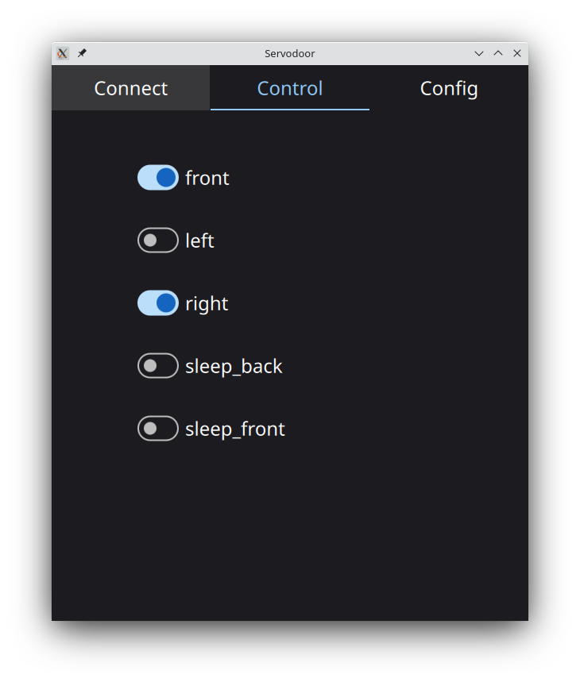

servodoor-app

PySide6 base T-maze door control app using the [servodoor](https://github.com/willdickson/servodoor) library and 
[servodoor-firmware](https://github.com/willdickson/servodoor) firmware.  

